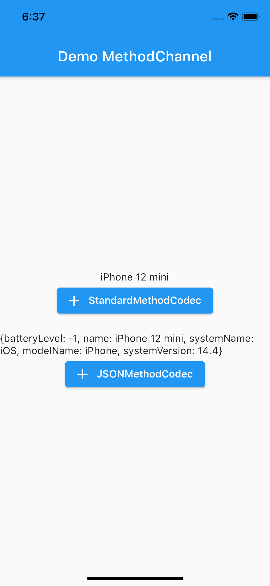
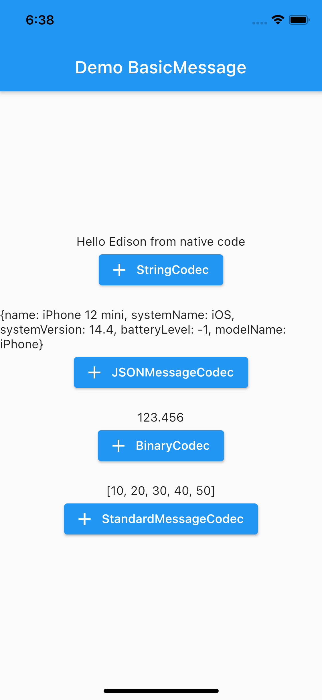
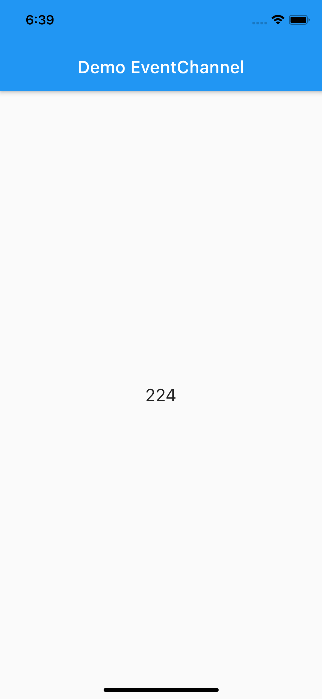

# flutter_platform_channel

A sample app which demonstrates how to use `MethodChannel`, `EventChannel`, `BasicMessageChannel` and `MessageCodec` in Flutter (Java & Swift).

## Screenshot
- MethodChannel

- MessageChannel

- EventChannel
